Introduction
=============

This project is an outgrowth of two other very early Python-for-Fun projects: Logic Circuits and Logic Cirucuits two. These are still accessible and draw a fair following of readers. In those projects you have the ability to build digital logic circuits with primitive components and encapsulate a circuit into a component that can be used (even multiple times) in a more elaborate circuit. In those projects we ended up building a circuit to add binary numbers and another to multiply.

This project is similar but with a somewhat different focus. 

  * Components are drawn on a canvas, laid out relative to each other and connected with wires.
  
  * The circuits contain a graphic representation of their components. This is done using Pygame.
  
  * Instead of more complex basic components such as the DFlipFlop, everything in this project is built from 2 input Nand gates and inverters, 3 types of switches, connectors and wires. By the end we will build a complete 4-bit binary counter.

  * The display of the circuits may be zoomed in and out, through different layers of circuitry.

  * The circuits run in an animation where the high and low signals in the wires are displayed by changing the color of each wire. Combined with the zoom lens it is much easier to see how everything works together.
  
  * Most everything is object oriented and each component or circuit class also has a test class which creates a demo for this write-up.
  
The amount of code is a bit on the high side, but still, I think it will be very approachable. There are about 500 lines of code that build and animate components and circuits. Another 200 lines are in the test classes. 

It's good if you can have pygame installed so that you can follow along while the animations are running. But even if not the screen-shots here should enable you to understand everything.

We will look at the basic components, and combine them into small circuits. Circuits can be encapsulated which makes them look and act like basic components. Within an encapsulated circuit there are other components, including, perhaps, inner circuits.

Each component within a circuit resides in a *layer*. The layer is assigned automatically and is one greater than its parent circuit. The top circuit resides in layer 1 by itself. 

When we view an animation we specify the layer depth to which we will view. Any circuit at this depth will be shown as a box. Circuits above this value will be shown expanded. Basic components at or above (i.e. lower layer numbers) will also be drawn as well as the wires connecting everything. Components and circuits in higher (deeper) layers are not drawn but they are still running.

Along with components we have connectors. Each basic component has a fixed number of connectors with names (like A,B,C). Wires run between connectors, linking a single output to zero or more inputs. Circuits also have connectors that link their output and inputs to internal connectors. 

Basic Components
================

The components that are "built-in" are the 2 input NAND gate, the INVERTER, and 3 kinds of switches. From these basic parts we'll build simple circuits and later encapsulate circuits into components to be used in more complex circuits.

The INVERTER is treated as a seperate component, but it could be easily made from a NAND gate by simply connecting both inputs to the same source.

The NAND gate has a little circle on its output. This means that the output is calculated as an AND of the inputs and then inverted. Inversion is important. Without it we couldn't build most of what we be showing, especially memory circuits.

This is also how actual electronic gates work. The INVERTER does nothing more than simply change high to low or low to high. In electronic gates high is usually 5 volts and low is 0 volts. Here high is red and low is blue.

Here is our first circuit that uses four of the five basic components.

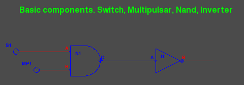

N1 is a NAND gate whose output (C) is low (blue) only if both inputs (A and B) are high (red). The inputs of N1 are switches. S1 is a simple toggle switch. Each time it is clicked it turns either *off* or *on*. MP1 is a multi-pulsar. If clicked on it produces a pulse stream alternating between high and low. Clicked again returns it to its rest state (high).

The INVERTER I1 simply produces an output (B) which is the reverse of its input (A).

N1 and I1 together in this configuration form an AND gate whose output is high (red) if and only if both inputs are high. Though we won't be using AND gates in this project, it's nice to see how one can be built as a circuit.

As long as S1 is on (outputing red), then whatever is produced by MP1 will be duplicated at I1's output. If S1 is clicked off however, the AND circuit will not pass on the signal from MP1. This is how an AND gate can work as a gateway. To run this in python use the command::

   $ python basics.py 
   
First click MP1 to start a pulse stream going. Then toggle S1 to see how the signal from MP1 is either stopped or passed through.

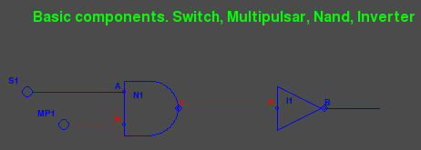

.. image:: images/basic-03.png

The next circuit uses 2 INVERTER gates feeding a NAND. This circuit forms the equivalent of an OR gate. The output of the NAND (connector N1.C) is high if either or both of inputs (the outputs of switches S1 and S2) are high. 

Notice that in both the AND and OR circuit, two single inversions cancel each other out, resulting in "positive" logic. Here are two images one with both input low and another with one input high::

   $ python or1.py

.. image:: images/or1-01.png

.. image:: images/or1-02.png

You might have noticed something else about the above screen shots. Here the connectors are labled (A,B,C) along with the components (N1,I2,S1,S2). We'll get into how text processing is done when we discuss the code.

Encapulating a Circuit
======================

The test program or2.py encapsulates the OR circuit onto layer 2. If we view into layer 2 by passing the command line argument "2" we see the following::

   $ python or2.py 2

.. image:: images/or2-01.png

Notice the labeling on the connectors. The boxed up "or" gate has inputs "A" and "B" and each switch a "B" connector.

Now let's peer into layer 3 we to see the details::

   $ python or2.py 3

.. image:: images/or2-02.png

Notice how there are more labels. The A-B-C from the box is still showing. Though the box is not shown, these connectors into the circuit still exist. The other labels are all tied to the components inside the circuit.

Before, we were not passing a *layer* argument into the test programs. This is because the default layer is in fact 2. 

Something a bit more complex
============================

An XOR gate (exclusive or) outputs high if one and only one input is high. Below is a circuit using 4 NAND gates to provide this function on connector N4.C. The inverter to the right changes the function to an XNOR::

   $ python xor.py 3

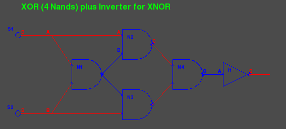

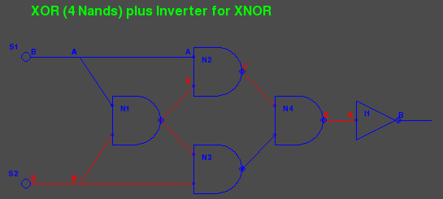

The program xor.py encapsulated the 4 NAND gates into a circuit component on layer 2. Viewing through to layer 3 looks into the encapsulation. But if we look just through layer 2 instead we see::

   $ python xor.py 2

.. image:: images/xor-03.png

The inverter on the right still resides in layer 2. We'll look later closely at the code.

Now an XOR gate has its own drawing form which is NOT a rectangular box. So do the AND and OR gates. But we're not going to use them further so I didn't spend time on their looks. The flip-flops that now follow do traditionally fit into a box.

Flip-flops
==========

In the earlier projects we built a simple latch from 2 NAND gates. This demonstrated that positive feedback to could be used to remember or store data. Here is a simple latch::

   $ python latch.py 3

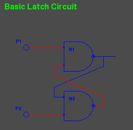

Pulsars P1 and P2 each issue a short single pulse to low when clicked and then return to high. The 2 NAND gates form a one-bit memory unit that basically can remember which pulsar was last clicked. Click them one after another and watch the output change. If this is new for you study the circuit and understand why it works as it does. Encapulated the circuit looks like::

   $ python latch.py 2

.. image:: images/latch-02.png

The inputs on the left of the encapsulation box are generally labeled A and B and the output on the right is labeled Q (not C) and is connected to the C output of N1.
We're going to avoid labeling every input and output when it is clear from the layout.

The Data Latch
==============

The simple latch is not often used because we usually want to do something else: A data line coming in and the ability to clock the data value at a given point in time. By adding some front-end logic we can have exactly that::

   $ python dlatch.py 3

.. image:: images/dlatch-01.png

Let's take a minute to study this. The data coming in from D1 (a simple toggle switch) is delivered to N1 and N2 but because of the inverter I1 it is delivered at opposite polarity. C1 is a one-shot pulsar delivering a short downward pulse when clicked. I2 makes this an upward pulse to N1 and N2. One of the outputs N1.C or
N2.C then drops setting the simple latch L1.

We can also set the view all the way into layer 4 to see the working of L1 as well::

   $ python dlatch.py 4

.. image:: images/dlatch-02.png

There is a small problem, however. While the clock line is active (low) and change on the data line will be immediately be passed through to the output. This may or may not be serious depending on the application. For us it is very serious because we will be using more feedback from outputs back to inputs. There is a way around this though.

Edge Triggered Data Latch
=========================

This circuit works something like an airlock. Or here in Northern Germany (and in the Netherlands) water locks between canals. Or even the locks on the Panama Canal bringing ships over the mountains. The idea is simple. Don't let the air or water or signal rush through when the door is open. Use two doors. When one door closes the other is opened.

The simple Data latch is like a single door and when the clock is low the door is opened. Our improved E-latch will use 2 D-latches and with a single inverter their 2 clock inputs can be exactly out of step. When one is open the other is closed.

Here are three screen shots viewing through to layers 2, 3, 4 and 5::

   $ python elatch.py 2

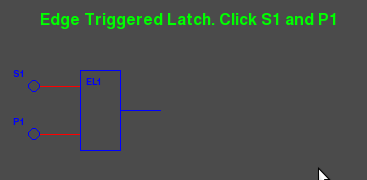

::

   $ python elatch.py 3

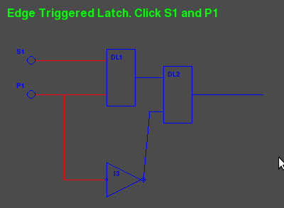

::

   $ python elatch.py 4

.. image:: images/elatch-04.png

::

   $ python elatch.py 5

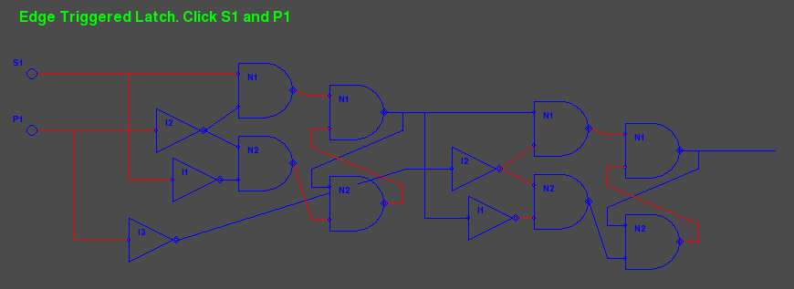

It reminds me a lot of using the zoom feature on mapquest

The Divide by Two Circuit
==========================

By adding just one inverter, we can turn an E-latch into a circuit with just one input (the clock) and convert a pulse stream on the input to another on the output with exactly half the frequency. 

By feeding the output back to the data input inverted, the output will flip to the opposite polarity each time a pulse come in on the clock. In fact the output will flip each time the input clock goes from low to high. This creates a new pulse stream on the output with just half the frequency. Here is what it looks like::

   $ python div2.py 3

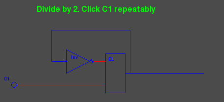

The Four Bit Binary Counter
============================

By simply stringing four div2 circuits together the outputs become bits in a binary counter. Here's what the circuit looks like at layer 3::

   $ python counter.py 3 1

.. image:: images/counter-01.png

Notice that there are now 2 arguments on the command line. The first is still the layer to view. The second is a scale factor that determines the size of components drawn to the screen. This defaults to "2". But specifying "1" we get a half scale. Sometimes "3" and "4" are used as well to magnify the circuit. 

The screen shot was taken while the counter was in operation. At the bottom the blue lines represent '1' bits, the red lines '0'. We caught the count at '0101' or in decimal 5.

The counter counts up to '1111' and then wraps back to '0000'. And if we take the red lines for '1' instead of blue, we have a counter that counts down to zero and then wraps back to 15 decimal.

Here is a partial view of the circuit at layer 5::

   $ python counter.py 5 1

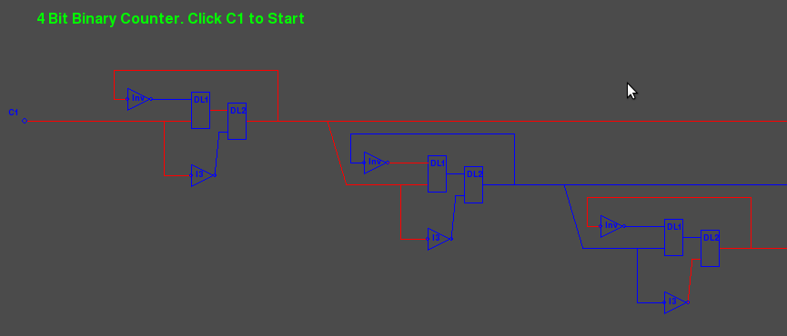

Design Concepts
=======================

Settings
--------

The module `<settings.py>`__ contains constants and also extracts scale and layer variables from the command line. Constants include colors we use as RGB tuples, screen dimensions, animation speed and parameters for the single and repeating pulse switches.

Component Abstract Class
------------------------

The component class `<component.py>`__ is an abstract class. Basic component classes (Nand2, Inv, Swt) inherit this class as well as the circuit class. Component contains the attributes that all the sub-classes have in common such as name, position, layer and scale. Also common methods such as position alignment, handling mouse clicks, scaling drawing arguments. Sub-classes do not define their own __init__ method but must define a setupGraphics method which is called at the end of Component.__init__ 

Basic Gates and Switches
------------------------

The module `<gates.py>`__ contains the classes for the 2 input NAND gate (Nand2), the INVERTER gate and the the 3 types of switches. Each has a standard set of methods.

The setupGraphics methods make connectors to attach to the drawing. the self.output connector is mandatory as it's the source of a wire tree (more coming) that will disperse the output of the gate to appropriate input connectors.

The draw methods contain a list of arguments to use with pygame drawing commands. These arguments must be scaled before used to draw polygons, circles, etc.

Every component must have a computeOutput method which calculates the gate's output from its inputs and sometimes its history. Flip-flop circuits are full of history.

The switches also have a takeClick method to respond to being clicked by the mouse. (turned off or on) and the pulsar switches have fairly complex computeValue methods

Connectors
-----------

Connectors `<connector.py>`__ have several things in common with components but there are enough differences to make subclassing unattractive. Both have a parent, a name, a position, a value and live in a given layer. Components have connectors for their inputs and output. The component is the parent of these connectors and they all reside in the same layer. For circuits that are encapsulated their external connectors reside one layer above the inner connectors.

Connectors are connected to each other with wires. Interestingly, wires don't have a representation in the code. They are simply drawn during animation as a pygame line in either the HOT or COLD color from the source connector to one of its children in the feed list.

Connectors may also reside indepently within a circuit. In this case the circuit is the parent and both circuit and connector reside in the same layer. These connectors make it easy to "fan out" a signal on a wire are even simply let a wire change direction.

If a connectors parent has to move (scoot over), then the connector must also. The subject of alignment in circuit layout will be discussed below.

During construction of a circuit the method *addWire* connects components together. This method takes an arbitrary number of connector instances, or *(x,y)* positions as arguments. Each position argument creates a free standing connector named "Anon" at the x,y position. Method *addWire* works down the arguments and populates the *feeds* list each connector appropriately. It returns the last connector as its function value, letting us chain these calls or fan a signal out.

During animation the method *drawWires* recursively walks the links between connectors and paints wires (lines) along the way. Since they are just wires all connected together, they all carry the same signal and are painted the same color.

Wires are not drawn inside an encapsulated circuit. This is controlled the the layer attribute of both the source and target. If either is hidden (below the visible viewing layer) then the wire is not drawn.

Usually, two "connected" connectors reside on the same layer. The exception is with a circuit's external connectors (at layer n) and its internal wiring (at layer n+1). 

Also during animation the method *sendOutput* works much like *drawWires*. It transmits the signal from an output connector, through other connectors, on to input connectors on basic components. The difference is that, unlike *drawWires*, *sendOutput* doesn't stop at the hidden layer, but goes right to the bottom. The *sendOutput* method is defined for components as well as connectors.

Text Processing
---------------

Text (`<text.py>`__)  is used to label basic components and encapsulated circuits with their names, create banners and to optionally label connectors. Text is tied to a given x,y point and placed in one of four quadrants. When text.py is run stand-alone it creates a image that shows how the four quadrants are used::

   $ python text.py

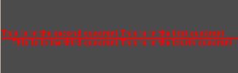

Alignment
---------

Early versions of this project required me to carefully position each component of a circuit working out the x,y position by hand. The origin of a component or circuit is the upper left corner, basically the pygame convention. If a component is inside a circuit its x,y is relative to the origin of the circuit.

When we try to scale, placing items by hand can quickly fall apart. What works much better is to place the first component at a x,y position and then place other components relative to the first or to each other. 

It turns out that it's very effective if a circuit or component can align itself to another by specifying one of its own connectors and another connector from the target, along with an offset (xoff,yoff). We then have a very flexible system that can adapt to growing and shrinking quite nicely. You've already seen this is the above screen shots. We want to use connectors because we run wires between them and this makes it easy to space components easily and to have wiring that is largely horizontal or vertical.

The methods *align* and *scootOver* make this work. If a circuit is aligning itself to another it will scoot over appropriately and all the bits inside (components, connectors, subcircuits) must scoot over too. This is the sort of situation where recursion becomes fun. We'll be seeing more of this now as we start to examine more of the code.

A Walk through some Code
========================

A Simple Animation
------------------------

Let's have another look at our first circuit.

Here is the Python code to build and then animate it::

  # basics.py
  #  Show off the basic gates in a simple circuit
  #
  from   gates     import MultPuls, Nand2, Inv, Swt
  from   circuit   import Circuit

  class TestBasic1 (Circuit) :
      def setupGraphics(self) :
          self.banner = "Basic components. Switch, Multipulsar, Nand, Inverter"

          n1 = Nand2(self,"N1", self.scale1((50, 30))) # Nand Gate
          i1 = Inv  (self,"I1")            # Inverter
          s1 = Swt  (self,"S1")            # Switch feeding input A
          m1 = MultPuls (self,"MP1")       # Pulsar feeding input B

          s1.align(s1.B, n1.A, -50, 0)  # line up the gates
          m1.align(m1.B, n1.B, -30, 0)
          i1.align(i1.B, n1.C,  80, 0)  # inverter follows Nand

          n1.A.labelQuad = 2            # Label all connectors
          n1.B.labelQuad = 2
          n1.C.labelQuad = 1
          i1.A.labelQuad = 2
          i1.B.labelQuad = 1

          self.gates = (m1,s1,n1,i1)
          s1.B.addWire(n1.A)
          m1.B.addWire(n1.B)
          n1.C.addWire(i1.A)
          i1.B.addWire( (i1.B.x(30), i1.B.y()))  # tail to see

  if __name__ == "__main__" :
      import gameloop
      from   settings import CmdScale
      circuit = TestBasic1 (None, "TestBasic1",(100,100),scale=CmdScale)
      gameloop.gameloop(circuit)

Let's explain what is going on. The program can run stand-alone with the module name "__main__". The gameloop animation expects to be passed a circuit to animate (bottom) so we define a class for our circuit and build an instance of it. This is a subclass of *Circuit* inheriting all of the standard code and we supplement it with the method *setupGraphics*. An instance of *TestBasic1* is built in the second to last line and then passed to the *gameloop.py* for animation.

The *setupGraphics* method defines the 2 gates and 2 switches and sets the banner attribute. Only the Nand gate is given a position of (50,30) scaled and offset relative to its parent; in this case the pygame screen. The Inverter and 2 switches are created with a default position (0,0) and then align themselves to the Nand gate. Switch *s1* aligns it output connector 50 units to the left of the Nand's A input. The inverter *I1* aligns its input 80 units to the right of *N1*'s output connector. A unit here is one pixel times the scale factor. The scale factor defaults to two.

The connectors are all assigned a *labelQuad* attribute to have their labels printed in the appropriate quadrant. The circuit *self* is assigned a *gates* attribute. This is a list of its components and used by the abstract *Circuit* class. Finally, wires are created connecting the two switches to the Nand, the Nand to the Inverter and then a piggy tail wire just to show the final output from the Inverter.

Circuits
---------

The Circuit class `<circuit.py>`__ lets us combine components and optionally encapsulate them into a single component with its own connectors to the outside world. Circuits made for encapsulation (put into a box) do not have switches or banners and typically we don't label the interior connectors. However the outermost (top) circuit is generally never encapsulated and it makes sense to have switches within.

The class is quite small and enables the animation of a circuit with the following

  * The method *computeOutput* for a circuit simply calls the same for each component in its *gates* attribute as well as *sendOutput* which distributes the signals within the circuit. The order of computation and distribution is set by the order of the components in *gates*
  
  * The method *checkClicked* simply passes asks each of its components to do the check for the being clicked and repsond. This is only in the top non-encapsulated circuit.
  
  * The draw method provides 3 possibilities. 
  
    #. The circuit may be hidden and not drawn at all if it resides below the viewing layer.
    
    #. The circuit may be drawn as a box with just a label and external connectors if it exactly on the viewing layer.
    
    #. The circuit may be drawn in detail if it is above the viewing layer.

A Fuller Example
-----------------

Let's return to the OR circuit `<or2.py>`__ and look at the code. This will be the only module we'll study in detail. All the later circuits follow exactly the same pattern.

.. image:: images/or2-02.png

The first part of the *setupGraphics* method looks like::

  class Or (Circuit) :
    def setupGraphics(self) :
        n1 = Nand2(self,"N1", self.scale1((80, 30))) # Nand Gate
        i1 = Inv  (self,"I1") # Inverter for n1.A
        i2 = Inv  (self,"I2") # Inverter for n1.B
        # external connectorself. Same depth as xor circuit
        i1.align(i1.B, n1.A, -40, -20)  # inverter precedes Nand
        i2.align(i2.B, n1.B, -40,  20)  # inverter precedes Nand
        self.A = Connector(self,"A",((i1.A.x(-20),i1.A.y() )))
        self.B = Connector(self,"B",((i2.A.x(-20),i2.B.y() )))
        self.C = Connector(self,"C",((n1.C.x( 20),n1.C.y() )))
        self.output = self.C       # who is output

        self.gates = (i1,i2,n1)
        self.i1,self.i2,self.n1 = (i1,i2,n1)

We define the 3 gates with the circuit *self* as the parent. The first one *n1* is set at a scaled position in the circuit. The two inverters *i1* and *i2* are defined and then aligned to *n1*. The exteral connectors *A*, *B*, and *C* are built and placed at a *(x,y)* position relative to the internal gates. These positions are used if the circuit is drawn in detail. The output is identified as connector *C*. The *gates* attribute is constructed. The individual gates are also kept as attributes of the circuit. This allows them to be referenced from outside the circuit itself (only sometimes a good idea)::

  continued ....
        i1.B.addWire(n1.A)
        i2.B.addWire(n1.B)
        self.A.addWire(i1.A)
        self.B.addWire(i2.A)
        n1.C.addWire(self.C)

        if self.encapsulated() :  # if encapsulated re-work externals
            self.A.pos, self.B.pos, self.C.pos = self.scaleM((0,5),(0,35),(20,20))

The rest of *setupGraphics* method does the wiring between connectors both internally and to the 3 external external connectors *self.A*, *self.B* and *self.C*. So now, if the circuit is displayed in detail these 3 external connectors are in position to be wired into the circuit above. If the circuit is shown encapsulated (as a box) then these connectors need to take new positions that align to the box.

Next we have test circuit whose purpose is simply to instantiate and Or circuit and test it by adding switches, a banner and what not. In this case we labeled all of the connectors both inside (like *or2.n1.A*) and outside (like *s1.B*). Here is the code for that::

  class TestOr (Circuit) :
    def setupGraphics(self) :
        self.banner = "Encapsulated OR circuit"
        or2 = Or(self,"O2"  , self.scale1((50,30)))
        s1 = Swt  (self,"S1")   # Switch feeding input A
        s2 = Swt  (self,"S2")   # Switch feeding input B

        s1.align(s1.B, or2.A, -30, 0)  # line up the gates
        s2.align(s2.B, or2.B, -30, 0)
        s1.B.addWire(or2.A)
        s2.B.addWire(or2.B)
        s1.B.labelQuad = 1
        s2.B.labelQuad = 1
        self.gates = (s1,s2,or2)

        or2.n1.A.labelQuad = 3            # Label all the connectors
        or2.n1.B.labelQuad = 2
        
Finally, or2.py is meant to be run as main. When it is invoked from the command line 
the scaling factor and view layer are taken from sys.argv or left as defaults as the *settings* module `<settings.py>`__ is imported. Then a TestOr instance is created, which further creates an Or instance along with the surroundings to test it. The TestOr instance is passed to the gameloop function.

This same pattern is used in the modules that stack like nested russian dolls. Once you understand one, the others are easy.
 
 `<latch.py>`__, 
 `<dlatch.py>`__, 
 `<elatch.py>`__, 
 `<div2.py>`__, 
 `<counter.py>`__. 

Each one can run stand-alone from the command line and uses one or more objects from the previous module. 

The gameloop
-------------

When one of the stand-alone modules is run as *main* it builds its test circuit and passes it to the gameloop function in `<gameloop.py>`__. The latter is short and pretty much boiler plate Pygame. It creates a screen and enters an event loop. The constant TICKS_PER_SECOND in the settings module specifys how rapidly the loop is run. 

Within the loop a few thing happen. A mouse click on the window termination *x* will shut the program off. A mouse click on a switch (or pulsar) will toggle it. The switch is found by a recursive search through layers of circuits, generally not very deep. Next, the circuit is asked to compute its output, a request that also is sent recursively through the tree of circuits producing signals sent through wires at all layers. The screen is then erased and the circuit is drawn, wires and all. The draw request is also sent recursively through the circuits. Finally, the screen is flipped and the process repeats. At the default setting 200 times a second.

